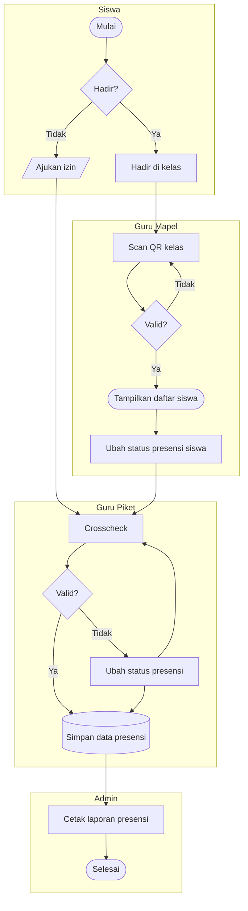

```mermaid
flowchart TB
    subgraph Siswa
        direction TB
        A([Mulai]) --> B{Hadir?}
        B -->|Ya| C[Hadir di kelas]
        B -->|Tidak| D[/Ajukan izin/]
    end

    subgraph Guru_Mapel["Guru Mapel"]
        direction TB
        E[Scan QR kelas] --> F{Valid?}
        F -->|Tidak| E
        F -->|Ya| G([Tampilkan daftar siswa])
        G --> H[Ubah status presensi siswa]
    end

    subgraph Guru_Piket["Guru Piket"]
        direction TB
        I[Crosscheck] --> J{Valid?}
        J -->|Tidak| K[Ubah status presensi]
        K --> I
        J -->|Ya| L[(Simpan data presensi)]
        K --> L
    end

    subgraph Admin
        direction TB
        M[Cetak laporan presensi] --> N([Selesai])
    end

    C --> E
    D --> I
    H --> I
    L --> M
```