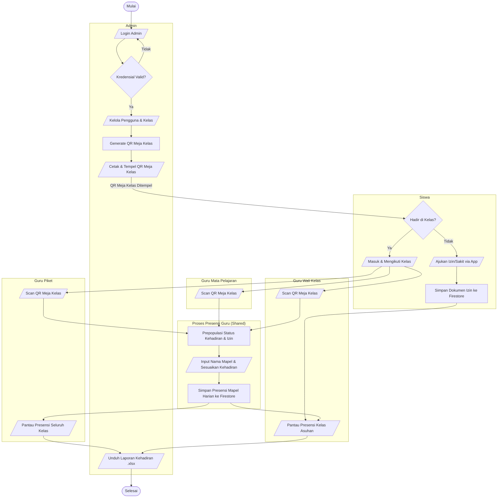

# Flowchart Sistem Presensi Sekarang

Dokumen ini berisi flowchart alur sistem presensi yang berjalan saat ini pada aplikasi **SMP Muhammadiyah 1 Sekampung Udik** berdasarkan analisis codebase Flutter.

Alur sistem ini diurutkan secara terpadu (sequential) dari terminal **Mulai** hingga **Selesai**, dengan pembagian visual yang dipisah secara tegas berdasarkan **Peran (Role)** masing-masing.

Proses pengisian presensi setelah memindai QR Meja Kelas bersifat **sama dan dapat dilakukan oleh semua peran Guru** (Guru Mapel, Guru Piket, maupun Wali Kelas). Oleh karena itu, alur input presensi ini ditempatkan dalam modul proses bersama (shared).

---

## Diagram Alir Sistem (Mermaid Flowchart)

---

## Penjelasan Alur Berurutan (Mulai sampai Selesai)

1. **[Terminal] Mulai:** Memulai proses presensi harian sekolah.
2. **Setup Admin:** Admin masuk ke sistem (di-verifikasi), mengelola data pengguna/kelas, memproses pembuatan QR kelas, dan mencetak QR Meja Kelas.
3. **Keputusan Siswa:** Di pagi hari, siswa menentukan kehadirannya:
   * **Jika tidak hadir:** Siswa mengajukan izin/sakit melalui aplikasi, disimpan di database, dan masuk ke pantauan **Wali Kelas**.
   * **Jika hadir:** Siswa masuk kelas dan bersiap mengikuti pelajaran.
4. **Pemindaian QR Meja Kelas (Semua Guru):**
   * **Guru Mapel**, **Guru Piket**, maupun **Wali Kelas** dapat memindai QR Meja Kelas yang tertempel untuk memulai pencatatan/koreksi kehadiran siswa.
5. **Pemrosesan & Input Presensi (Modul Bersama):**
   * Sistem otomatis mendeteksi ID kelas, memuat daftar siswa, dan menandai (*prepopulasi*) status siswa yang sudah terdaftar Izin/Sakit pada hari itu dari database.
   * Guru menginput nama mata pelajaran (jika KBM) dan menyesuaikan status kehadiran siswa (Hadir, Sakit, Izin, Alpa), lalu menyimpannya ke Firestore.
6. **Pemantauan Dasbor Guru:**
   * **Guru Piket** dapat memantau kehadiran harian seluruh siswa dari semua kelas di sekolah secara real-time.
   * **Wali Kelas** memantau kehadiran harian khusus siswa kelas asuhan yang diampunya.
7. **Laporan & Rekapitulasi:**
   * Admin menarik seluruh data kehadiran siswa dari database dan mengunduh berkas laporan rekapitulasi `.xlsx` (Excel).
8. **[Terminal] Selesai:** Seluruh rangkaian presensi hari itu selesai direkam.
