# BAB IV
# HASIL DAN PEMBAHASAN

## A. Hasil dan Pembahasan

Data dan informasi yang digunakan oleh penulis adalah hasil penelitian yang dilakukan pada SMP Muhammadiyah 1 Sekampung Udik. Dalam riset yang dilakukan pada tanggal 15 Januari 2025 hingga 15 Maret 2025, penulis menemukan permasalahan bahwa proses pencatatan presensi siswa di sekolah tersebut masih banyak dilakukan secara manual menggunakan lembar kertas absensi fisik yang dibawa oleh guru piket atau ditulis oleh guru mata pelajaran di kelas. Pola pencatatan tersebut dinilai kurang efisien karena sering terjadi ketidaksinkronan data kehadiran siswa antara wali kelas, guru piket, dan guru mata pelajaran, serta berisiko tinggi terhadap kehilangan atau kerusakan lembar kertas absensi fisik. Selain itu, proses rekapitulasi kehadiran mingguan dan bulanan memakan waktu yang cukup lama dan rentan terhadap kesalahan rekap, sehingga menyulitkan kepala sekolah dan guru piket dalam memantau statistik kehadiran siswa secara real-time. SMP Muhammadiyah 1 Sekampung Udik belum menyediakan sistem informasi presensi terintegrasi berbasis mobile yang dapat mendeteksi kehadiran secara instan menggunakan kode QR atau menyediakan pengajuan surat izin sakit dan izin secara online bagi siswa. Akibatnya, wali kelas tidak dapat memantau riwayat ketidakhadiran siswa dengan cepat, dan siswa harus membawa surat fisik ke sekolah yang seringkali terlambat diserahkan atau terselip, memicu ketidakefisienan dalam pengelolaan administrasi sekolah.

Penelitian ini bertujuan untuk merancang dan membangun sistem informasi presensi siswa berbasis mobile menggunakan teknologi QR Code pada SMP Muhammadiyah 1 Sekampung Udik yang akan dibangun bertujuan untuk memberikan pelayanan yang efektif, objektif, dan efisien dalam pengelolaan kehadiran harian dan mata pelajaran, memvalidasi presensi siswa secara instan, serta mengotomasi sinkronisasi pengajuan izin digital siswa kelas IX guna mendukung kinerja guru piket dan wali kelas.

Supaya mencapai tujuan penelitian maka penulis menggunakan metode pengembangan sistem RAD (Rapid Application Development) dengan metode pendekatan pemrograman berorientasi objek, di mana dalam metode ini memiliki beberapa tahapan dalam penyusunan, yaitu perencanaan kebutuhan (requirements planning), desain pengguna (user design), konstruksi (construction), dan penyelesaian (cutover).

### 1) Perencanaan Kebutuhan
Fase perencanaan kebutuhan (requirements planning) dalam metodologi RAD merupakan langkah awal untuk mengidentifikasi dan merumuskan seluruh kebutuhan sistem, baik dari sudut pandang fungsional maupun non-fungsional, berdasarkan observasi langsung terhadap alur presensi yang ada di SMP Muhammadiyah 1 Sekampung Udik. Tahap ini menyelaraskan tujuan administratif sekolah dengan kapasitas teknologi yang akan dikembangkan, sehingga meminimalkan redundansi data antara guru piket, wali kelas, dan guru mata pelajaran saat mengelola kehadiran siswa. Melalui diskusi intensif dengan kepala sekolah, staf tata usaha, guru piket, dan perwakilan siswa, dirumuskan bahwa sistem harus mampu mengotomasi pencatatan kehadiran harian siswa, memvalidasi surat izin digital secara instan, serta mempermudah guru piket dalam mengawasi rekapitulasi presensi mingguan dan bulanan.

Selain itu, perencanaan kebutuhan ini juga menentukan spesifikasi teknis dan lingkungan operasi agar aplikasi dapat berjalan optimal pada berbagai jenis gawai pintar yang dimiliki oleh guru dan siswa tanpa membebani memori perangkat. Fokus utama dari perencanaan ini ditekankan pada kegunaan (usability) antarmuka, keamanan data pada sisi server, dan efisiensi waktu pemrosesan data presensi saat jam pelajaran dimulai. Dengan mendokumentasikan seluruh kebutuhan ini secara formal, tim pengembang dapat membangun fondasi sistem yang kokoh dan terarah pada fase konstruksi berikutnya.

#### a. Analisis Kebutuhan Fungsional
Analisis kebutuhan fungsional menggambarkan proses-proses dan layanan yang wajib disediakan oleh aplikasi presensi siswa agar semua aktor dapat berinteraksi sesuai peran masing-masing. Kebutuhan fungsional ini dirumuskan berdasarkan kendala operasional yang terjadi pada sistem konvensional, seperti lambatnya rekapitulasi data kehadiran dan sulitnya melacak riwayat izin siswa.

| Kebutuhan Fungsional | Deskripsi |
|---|---|
| Autentikasi Pengguna (Login/Logout) | Sistem harus dapat memvalidasi kredensial pengguna (email & password) dan mengarahkan mereka ke dasbor sesuai peran (admin, piket, mapel, siswa). |
| Manajemen Pengguna (CRUD & Import) | Admin dapat mengelola akun pengguna, termasuk melakukan pendaftaran massal menggunakan file templat Microsoft Excel (.xlsx). |
| Pembuatan & Ekspor Kode QR Siswa | Admin dapat membuat kode QR unik terenkripsi untuk siswa kelas 9 dan mengekspornya sebagai berkas gambar (.png) untuk dicetak. |
| Pengelolaan Kelas & Wali Kelas | Admin dapat mengelola data kelas dan menugaskan guru piket/guru mapel tertentu sebagai wali kelas yang sah. |
| Pembuatan Sesi Presensi | Guru piket (sesi harian) dan Guru mapel (sesi mata pelajaran) dapat membuka sesi presensi aktif untuk kelas tertentu. |
| Presensi Siswa via Scan QR | Siswa dapat melakukan presensi mandiri dengan memindai kode QR kartu mereka ke kamera perangkat guru saat sesi aktif. |
| Validasi & Override Kehadiran | Guru piket dan guru mapel dapat mengubah status kehadiran siswa secara manual (Hadir, Izin, Sakit, Alpa) dan menambahkan catatan. |
| Pengajuan Surat Izin Digital | Siswa dapat mengajukan surat izin/sakit digital secara langsung (tanpa persetujuan manual admin) dengan mengunggah alasan ketidakhadiran. |
| Sinkronisasi Kehadiran Otomatis | Sistem otomatis menyelaraskan kehadiran siswa yang berizin/sakit saat sesi presensi dibuka oleh guru piket atau guru mapel pada hari tersebut. |
| Riwayat Izin Wali Kelas | Wali kelas dapat memantau log surat izin digital siswa di bawah kelas asuhannya secara real-time melalui dasbor guru piket. |
| Ekspor Laporan Kehadiran (Excel) | Admin dapat mengunduh rekapitulasi laporan kehadiran siswa per kelas langsung ke bentuk file Excel (.xlsx) yang sudah diformat rapi secara lokal. |
| Reset Data Kehadiran Tahunan | Admin dapat menghapus seluruh riwayat sesi presensi, kehadiran, dan surat izin melalui satu klik dengan konfirmasi keamanan saat tahun ajaran baru. |

Tabel 1. Kebutuhan Fungsional

#### b. Analisis Kebutuhan Non Fungsional
Analisis kebutuhan non-fungsional menitikberatkan pada batasan properti, kualitas, keamanan, dan kinerja operasional sistem yang mendukung kelancaran jalannya kebutuhan fungsional aplikasi presensi ini.

##### 1. Kebutuhan Perangkat Keras / Hardware
Kebutuhan perangkat keras menentukan spesifikasi fisik gawai pintar (smartphone) yang digunakan oleh seluruh peran pengguna, baik Admin, Guru Piket, Guru Mapel, maupun Siswa untuk menjalankan aplikasi presensi mobile. Karena modul admin sepenuhnya terintegrasi di dalam aplikasi mobile (bukan web dashboard terpisah), perangkat komputer/laptop hanya bersifat opsional yang digunakan oleh pengembang sistem selama masa konstruksi atau untuk kebutuhan administratif server Firebase.

| Hardware | Spesifikasi Minimum | Kegunaan |
|---|---|---|
| Smartphone Admin | Android 8.0 (Oreo), RAM 2GB, Koneksi Internet | Menjalankan aplikasi modul admin, mengelola pengguna (CRUD), mengimpor data masal Excel, membuat kode QR siswa, dan mengunduh laporan rekap bulanan (.xlsx). |
| Smartphone Guru | Android 8.0 (Oreo), Kamera Belakang 8 MP, RAM 2GB | Menjalankan aplikasi presensi, membuka sesi kelas, dan memindai kode QR kartu siswa. |
| Smartphone Siswa | Android 7.0 (Nougat), RAM 2GB, Koneksi Internet | Menjalankan aplikasi untuk melihat riwayat kehadiran pribadi dan mengajukan surat izin digital. |
| Laptop / PC Admin (Opsional) | Processor Core i3, RAM 4GB, SSD 128GB | Hanya digunakan jika pihak admin sekolah ingin memantau konsol cloud database Firebase Console secara langsung dari web browser. |

Tabel 2. Kebutuhan Perangkat Keras / Hardware

##### 2. Kebutuhan Perangkat Lunak / Software
Kebutuhan perangkat lunak mencakup sistem operasi, perangkat lunak pengembangan, library pendukung, dan layanan penyimpanan database awan yang digunakan untuk menyusun seluruh baris kode program aplikasi.

| Software | Spesifikasi / Versi | Kegunaan |
|---|---|---|
| Sistem Operasi OS | Android OS 8.0 ke atas, macOS Sequoia (untuk dev) | Lingkungan operasional utama aplikasi mobile. |
| Google Flutter SDK | Versi 3.x (Dart SDK ^3.12.2) | Framework utama pembuatan aplikasi cross-platform. |
| IDE / Text Editor | Visual Studio Code (VS Code) | Lingkungan penulisan kode program dan penelusuran eror (debugging). |
| Database Server | Cloud Firestore & Firebase Auth | Penyimpanan data kehadiran real-time dan autentikasi keamanan. |
| Google Chrome | Versi Terbaru | Mengakses konsol database Firebase dan administrasi sistem. |

Tabel 3. Kebutuhan Perangkat Lunak / Software

##### 3. Kebutuhan Perangkat Manusia / Brainware
Kebutuhan perangkat manusia mengidentifikasi karakteristik dan tingkat keahlian pengguna yang akan mengoperasikan aplikasi, memastikan bahwa interaksi sistem berjalan lancar sesuai fungsi masing-masing peran.

| Brainware | Peran dalam Sistem |
|---|---|
| Administrator (Staf TU) | Mengelola data master siswa, kelas, guru, membuat QR Code, dan mengunduh laporan rekapitulasi tahunan. |
| Guru Piket / Wali Kelas | Membuka sesi harian kelas, memvalidasi status kehadiran, dan memantau surat izin digital siswa. |
| Guru Mata Pelajaran | Memindai QR meja kelas, membuka sesi pelajaran, dan melakukan presensi massal/manual untuk siswa di kelas. |
| Siswa | Melakukan scan QR presensi mandiri, melihat catatan kehadiran personal, dan mengunggah surat izin digital. |

Tabel 4. Kebutuhan Perangkat Manusia / Brainware

---

### 2) User design
Fase desain pengguna (user design) dalam metodologi RAD menggabungkan analisis sistem dengan perancangan arsitektur antarmuka dan struktur data secara kolaboratif guna menghasilkan visualisasi sistem sebelum masuk ke tahap pengodean intensif. Pada fase ini, dirancang berbagai diagram pemodelan sistem menggunakan standar Unified Modeling Language (UML) seperti Use Case Diagram, Activity Diagram, Sequence Diagram, dan Class Diagram untuk mendefinisikan hubungan antar objek, alur data, serta struktur database operasional. Seluruh rancangan visual ini dirancang dengan prinsip kemudahan penggunaan agar pengguna dari latar belakang non-teknis, seperti staf pengajar dan siswa, dapat mengoperasikannya tanpa hambatan kognitif yang berarti.

##### a. Flowchart
Flowchart sistem menggambarkan secara grafis alur logika pemrosesan yang dilalui oleh setiap peran pengguna saat berinteraksi dengan aplikasi. Setiap flowchart disajikan dengan struktur kolom menyamping (swimlane) menggunakan diagram alir visual untuk memperjelas batas interaksi antara peran (Aktor) dan Sistem dengan berbagai simbol standar: Terminal (oval), Proses (kotak), Masukan/Keluaran (jajaran genjang), Tampilan (jajaran genjang asimetris), Keputusan (belah ketupat), dan Penyimpanan (tabung).

##### 1. Flowchart Admin

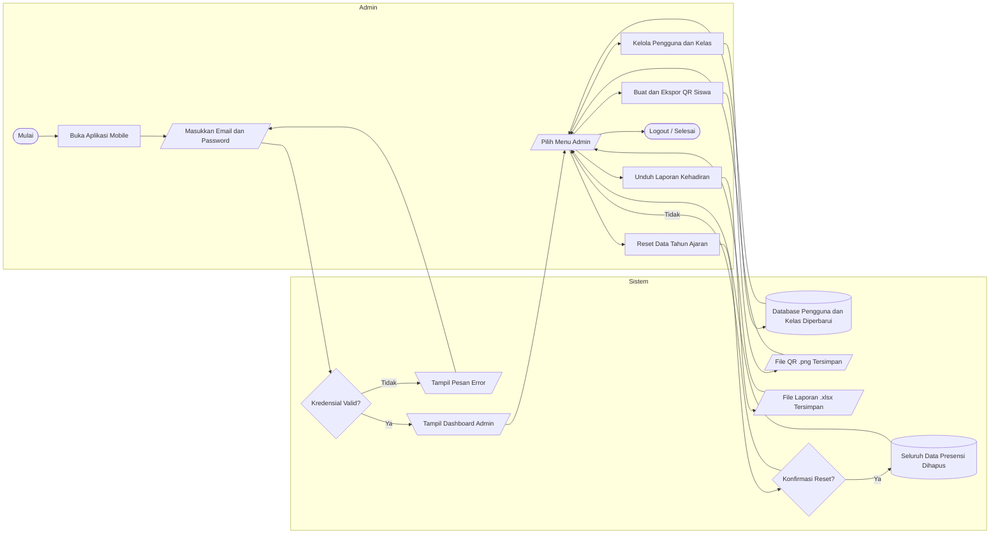

Gambar 1. Flowchart Admin

Berdasarkan flowchart di atas, alur sistem yang diusulkan dapat diuraikan sebagai berikut:
1. Mulai: Admin membuka aplikasi presensi mobile.
2. Login: Admin memasukkan email dan password, sistem memverifikasi kredensial ke Firebase Auth.
3. Dashboard Admin: Jika kredensial valid, sistem menampilkan halaman Dashboard Admin.
4. Pilih Menu: Admin memilih salah satu menu operasional yang tersedia.
5. Kelola Pengguna dan Kelas: Admin melakukan CRUD akun atau impor massal pengguna via file Excel; database Firestore diperbarui secara langsung.
6. Buat dan Ekspor QR Siswa: Admin membuat kode QR unik terenkripsi untuk seluruh siswa; file .png tersimpan di perangkat untuk dicetak sebagai kartu presensi.
7. Unduh Laporan Kehadiran: Admin memilih kelas lalu mengunduh laporan rekapitulasi kehadiran dalam format .xlsx ter-styling yang siap digunakan.
8. Reset Data: Admin menekan tombol Reset, sistem menampilkan dialog konfirmasi. Jika dikonfirmasi, seluruh data sesi, kehadiran, dan surat izin dihapus dari Firestore untuk memulai tahun ajaran baru.
9. Selesai: Admin melakukan logout dan menutup aplikasi.

##### 2. Flowchart Guru Piket

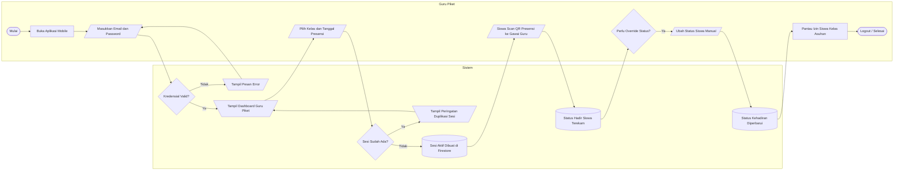

Gambar 2. Flowchart Guru Piket

Berdasarkan flowchart di atas, alur sistem yang diusulkan dapat diuraikan sebagai berikut:
1. Mulai: Guru Piket membuka aplikasi presensi mobile.
2. Login: Guru Piket memasukkan email dan password, sistem memverifikasi kredensial ke Firebase Auth.
3. Dashboard Piket: Jika valid, sistem menampilkan halaman Dashboard Guru Piket.
4. Buka Sesi Harian: Guru Piket memilih kelas sasaran dan tanggal presensi lalu menekan tombol Aktifkan Sesi.
5. Cek Duplikasi Sesi: Sistem memeriksa apakah sesi untuk kelas dan tanggal tersebut sudah pernah dibuat. Jika sudah ada, sistem menampilkan peringatan dan Guru Piket diarahkan kembali ke dashboard.
6. Sesi Aktif: Jika belum ada, sistem membuat dokumen sesi aktif di Firestore sehingga siswa dapat mulai memindai QR Card mereka.
7. Scan QR Siswa: Siswa mendekatkan QR Card ke kamera gawai guru piket; sistem otomatis merekam status hadir siswa di database Firestore.
8. Override Status: Guru Piket dapat mengubah status kehadiran siswa secara manual (Izin, Sakit, atau Alpa) jika diperlukan; perubahan tersimpan seketika ke Firestore.
9. Pantau Izin Wali Kelas: Jika guru berperan sebagai Wali Kelas, dapat memantau riwayat surat izin siswa kelas asuhannya secara real-time.
10. Selesai: Guru Piket melakukan logout dan menutup aplikasi.

##### 3. Flowchart Guru Mapel

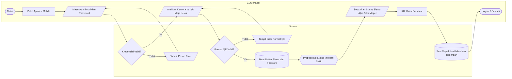

Gambar 3. Flowchart Guru Mapel

Berdasarkan flowchart di atas, alur sistem yang diusulkan dapat diuraikan sebagai berikut:
1. Mulai: Guru Mapel membuka aplikasi presensi mobile.
2. Login: Guru Mapel memasukkan email dan password, sistem memverifikasi kredensial ke Firebase Auth.
3. Scan QR Meja Kelas: Jika valid, sistem mengarahkan ke halaman kamera. Guru mengarahkan kamera ke QR Code yang tertempel di meja atau papan kelas.
4. Validasi QR: Sistem mendekode konten QR. Jika format tidak valid, muncul pesan error dan guru mengulang scan. Jika valid, ID Kelas berhasil terdeteksi.
5. Muat Data Siswa: Sistem secara asinkron mengambil daftar seluruh siswa kelas dari Firestore bersamaan dengan daftar surat izin aktif pada tanggal berjalan.
6. Prepopulasi Otomatis: Sistem otomatis menandai siswa yang memiliki izin atau sakit aktif ke status yang sesuai, lengkap dengan alasan izin yang tertera di bawah nama siswa.
7. Input Massal: Guru menyesuaikan status siswa yang absen tanpa izin (Alpa), kemudian mengisi nama mata pelajaran yang sedang diajarkan.
8. Kirim Presensi: Guru menekan tombol Kirim Presensi; sistem menyimpan dokumen sesi mapel berstatus closed dan seluruh data kehadiran siswa secara massal ke Firestore.
9. Selesai: Guru Mapel melakukan logout dan menutup aplikasi.

##### 4. Flowchart Siswa

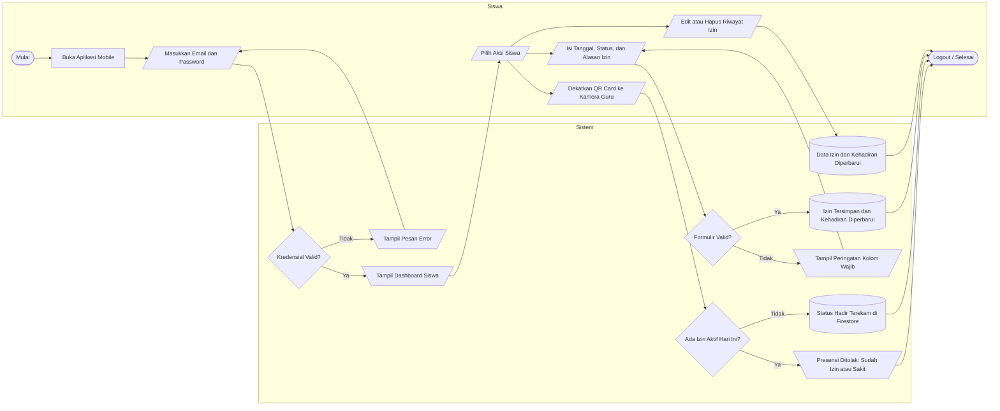

Gambar 4. Flowchart Siswa

Berdasarkan flowchart di atas, alur sistem yang diusulkan dapat diuraikan sebagai berikut:
1. Mulai: Siswa membuka aplikasi presensi mobile.
2. Login: Siswa memasukkan email dan password, sistem memverifikasi kredensial ke Firebase Auth.
3. Dashboard Siswa: Jika valid, sistem menampilkan halaman Dashboard Siswa beserta statistik kehadiran personal (persentase Hadir, Izin, Sakit, dan Alpa).
4. Pilih Aksi: Siswa memilih salah satu dari tiga aksi yang tersedia di dashboard.
5. Scan QR Presensi: Siswa mendekatkan QR Card ke kamera gawai guru piket yang sedang aktif memindai. Sistem memeriksa apakah siswa memiliki surat izin aktif pada hari tersebut. Jika ada, presensi ditolak dan ditampilkan peringatan. Jika tidak ada, status hadir siswa terekam secara otomatis di Firestore.
6. Ajukan Izin Digital: Siswa mengisi formulir pengajuan izin yang mencakup tanggal ketidakhadiran, pilihan status (Sakit atau Izin), dan kolom alasan tertulis. Sistem memvalidasi isian. Jika ada kolom kosong, muncul peringatan. Jika valid, dokumen izin disimpan ke koleksi leave_requests dan kehadiran siswa pada tanggal tersebut diperbarui secara otomatis di Firestore.
7. Edit atau Hapus Riwayat Izin: Siswa dapat mengubah detail atau menghapus pengajuan izin yang telah diajukan. Sistem memperbarui dokumen izin dan data kehadiran pada tanggal bersangkutan secara konsisten di Firestore.
8. Selesai: Siswa melakukan logout dan menutup aplikasi.


#### b. Use Case Diagram
Use Case Diagram mendefinisikan batas fungsional sistem dan menggambarkan hubungan interaksi antara aktor (pengguna) dengan use case (fitur-fitur) di dalam aplikasi presensi.

```mermaid
usecaseDiagram
    actor Admin
    actor "Guru Piket" as Piket
    actor "Guru Mapel" as Mapel
    actor Siswa

    Admin --> (Login & Logout)
    Admin --> (Kelola Pengguna & Kelas)
    Admin --> (Generate & Ekspor QR Siswa)
    Admin --> (Unduh Laporan Excel)
    Admin --> (Reset Data Kehadiran)

    Piket --> (Login & Logout)
    Piket --> (Buka Sesi Presensi Harian)
    Piket --> (Validasi & Override Kehadiran)
    Piket --> (Lihat Riwayat Izin Wali Kelas)

    Mapel --> (Login & Logout)
    Mapel --> (Scan QR Meja Kelas)
    Mapel --> (Input Kehadiran Massal)
    Mapel --> (Edit & Hapus Sesi Mapel)

    Siswa --> (Login & Logout)
    Siswa --> (Scan QR Presensi Mandiri)
    Siswa --> (Lihat Riwayat & Statistik Kehadiran)
    Siswa --> (Ajukan Izin Digital)
    Siswa --> (Edit & Hapus Izin)

    (Unduh Laporan Excel) .> (Login & Logout) : <<include>>
    (Input Kehadiran Massal) .> (Scan QR Meja Kelas) : <<include>>
    (Validasi & Override Kehadiran) .> (Buka Sesi Presensi Harian) : <<include>>
```

Gambar 1. Use Case Diagram Sistem Presensi

#### c. Activity Diagram
Activity Diagram memodelkan alur aktivitas dinamis berurutan di dalam sistem, menjelaskan bagaimana respon sistem terhadap setiap aksi yang dilakukan oleh pengguna pada fitur tertentu. Diagram ini dimodelkan menggunakan format swimlane menyamping (kolom peran, sistem, dan database) dengan variasi simbol standar flowchart agar lebih representatif.

##### 1. Activity Diagram Pengajuan Izin Siswa (Auto-Approval)

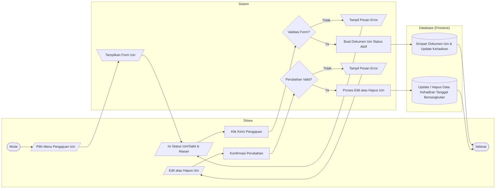

Gambar 5. Activity Diagram Pengajuan Izin Siswa

Berdasarkan flowchart di atas, activity diagram yang diusulkan dapat diuraikan sebagai berikut:
1. Siswa memilih menu Ajukan Izin pada dasbor siswa.
2. Sistem merespon dengan menampilkan formulir izin yang memiliki dropdown status (Izin/Sakit) tepat di atas bidang teks alasan ketidakhadiran.
3. Siswa mengisi data, memilih tanggal, menulis alasan, dan menekan tombol Kirim Pengajuan.
4. Sistem memvalidasi kolom inputan. Jika kosong, tampil pesan peringatan. Jika valid, sistem langsung membuat dokumen izin di Firestore.
5. Database menyimpan data tersebut dan otomatis memperbarui/mem-prepopulasi data kehadiran siswa pada sesi aktif di tanggal yang bersangkutan.
6. Jika siswa memilih untuk mengedit atau menghapus izin tersebut di kemudian hari, sistem akan mendeteksi perubahan tanggal dan memanggil metode pembersihan database untuk menghapus catatan presensi sesi kelas lama di Firestore secara otomatis.

##### 2. Activity Diagram Input Presensi Massal Guru (Scan Meja Kelas)

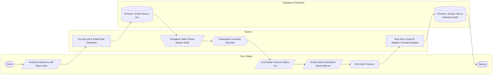

Gambar 6. Activity Diagram Input Presensi Massal Guru

Berdasarkan flowchart di atas, activity diagram yang diusulkan dapat diuraikan sebagai berikut:
1. Guru memilih menu Scan QR Meja Kelas di aplikasi.
2. Sistem membuka modul kamera dan guru memindai QR Code kelas yang tertempel di ruangan.
3. Sistem mengurai data QR, mencocokkan ID Kelas, dan secara asinkron mengambil data siswa serta surat izin yang diajukan hari ini dari Firestore.
4. Sistem menampilkan halaman input presensi dengan seluruh siswa berstatus "Hadir". Siswa yang berizin/sakit otomatis ter-prepopulasi ke status "Izin" atau "Sakit" lengkap dengan alasan izin di bawah nama mereka.
5. Guru menyesuaikan kehadiran secara manual jika ada siswa lain yang absen, lalu menekan Kirim Presensi.
6. Sistem merekam sesi kelas berstatus closed dan menyimpan seluruh data kehadiran siswa secara massal (bulk) ke dalam satu dokumen terpusat di Firestore.

##### 3. Activity Diagram Manajemen Pengguna oleh Admin

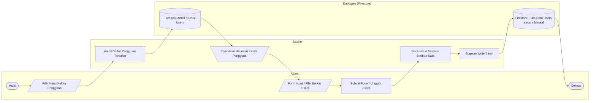

Gambar 7. Activity Diagram Manajemen Pengguna oleh Admin

Berdasarkan flowchart di atas, activity diagram yang diusulkan dapat diuraikan sebagai berikut:
1. Admin memilih menu Kelola Pengguna pada dasbor admin.
2. Sistem menampilkan tabel pengguna terdaftar dengan fitur pencarian dan filter kelas.
3. Admin memilih tombol Import Excel untuk mengunggah file `.xlsx` berisi daftar siswa baru.
4. Sistem memproses file tersebut menggunakan library `excel`, melakukan pencocokan kolom, dan mengirimkan transaksi penulisan secara massal ke database Cloud Firestore.

##### 4. Activity Diagram Pembuatan Sesi Harian oleh Guru Piket

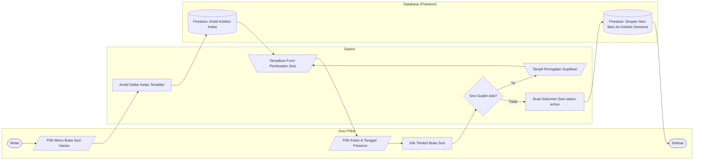

Gambar 8. Activity Diagram Pembuatan Sesi Harian oleh Guru Piket

Berdasarkan flowchart di atas, activity diagram yang diusulkan dapat diuraikan sebagai berikut:
1. Guru piket memilih menu Buka Sesi Harian di dasbor piket.
2. Sistem menampilkan daftar kelas yang aktif. Guru memilih kelas sasaran dan menentukan tanggal presensi (default hari ini).
3. Guru menekan tombol Buka Sesi.
4. Sistem memverifikasi apakah kelas tersebut sudah memiliki sesi aktif pada tanggal yang sama untuk menghindari duplikasi data.
5. Jika valid, dokumen sesi baru dibuat dengan status "active" dan tersimpan di database Cloud Firestore, sehingga siswa dapat memindai QR code mereka pada sesi tersebut.


#### d. Sequence Diagram
Sequence Diagram menggambarkan interaksi dinamis antar objek aplikasi berdasarkan urutan waktu pengiriman pesan (message) untuk menyelesaikan suatu skenario alur kerja.

##### 1. Sequence Diagram Autentikasi Login (Role Guard)
Diagram ini merinci interaksi antara antarmuka login, autentikasi Firebase, dan pengambilan profil pengguna.

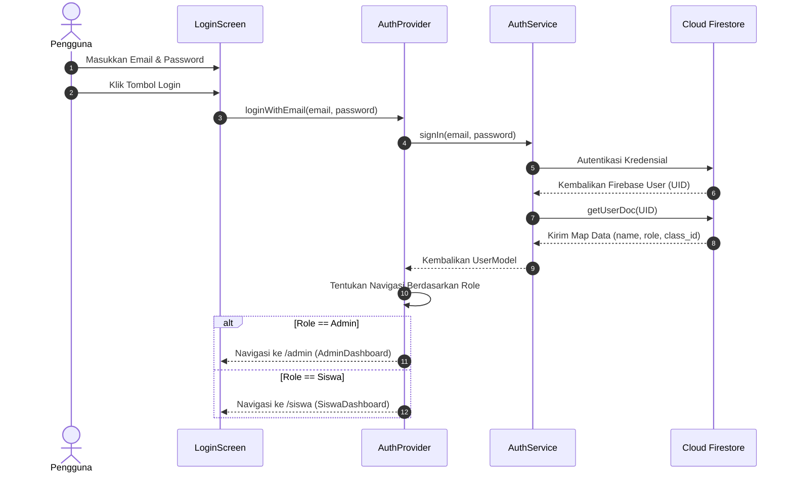

Gambar 2. Sequence Diagram Autentikasi Login (Role Guard)

##### 2. Sequence Diagram Presensi Mandiri Siswa (Scan QR & Proteksi Izin)
Diagram ini menggambarkan urutan pemeriksaan keamanan saat siswa memindai QR code mereka pada gawai guru piket.

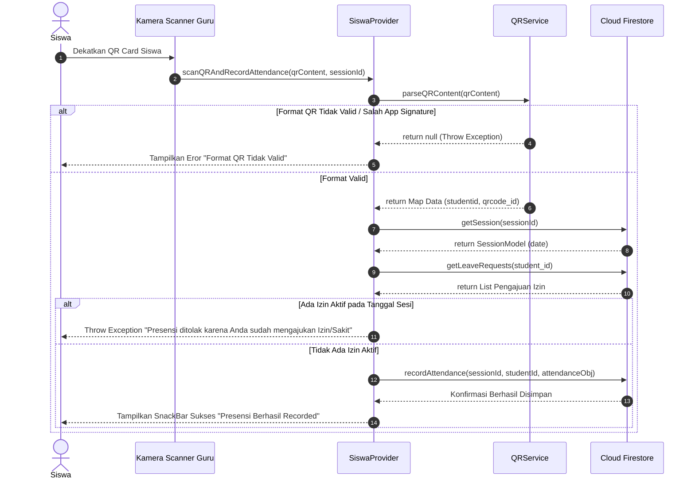

Gambar 3. Sequence Diagram Presensi Mandiri Siswa (Scan QR & Proteksi Izin)

##### 3. Sequence Diagram Presensi Massal Guru Mapel
Diagram ini memodelkan proses masukan massal kehadiran siswa kelas oleh guru mata pelajaran sesaat setelah memindai QR meja kelas.

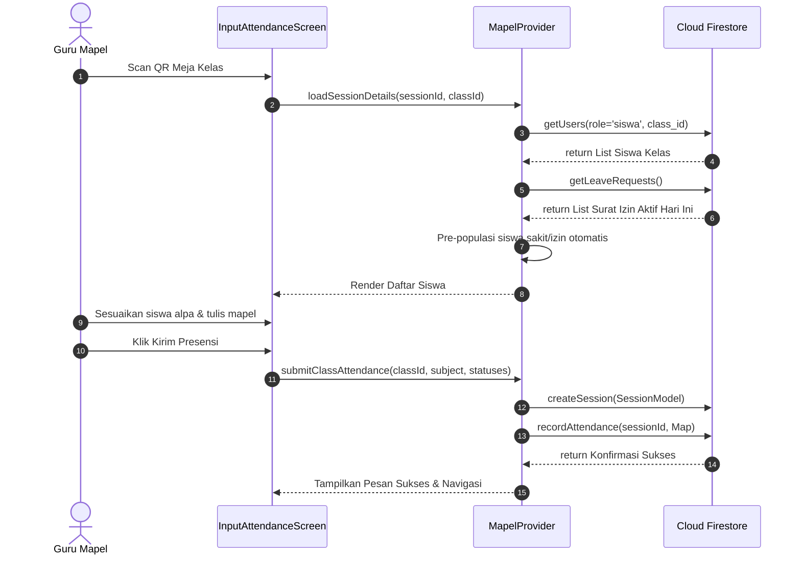

Gambar 4. Sequence Diagram Presensi Massal Guru Mapel

##### 4. Sequence Diagram Pengajuan Izin Digital Siswa
Diagram ini merinci interaksi asinkron saat siswa melakukan pengiriman pengajuan surat izin sakit/izin.

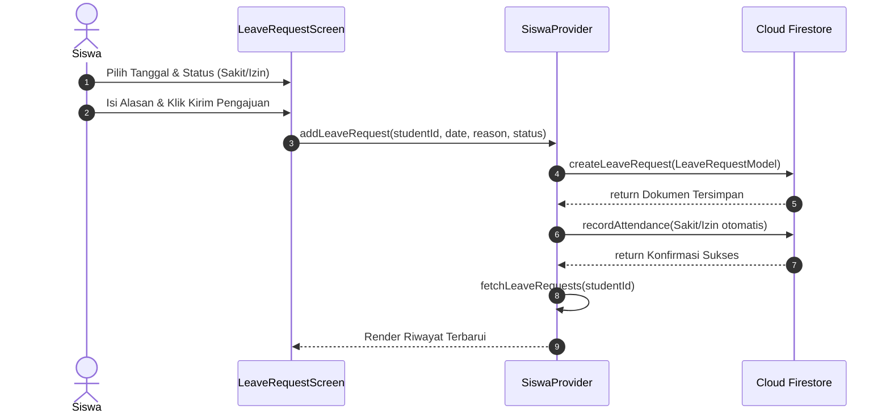

Gambar 5. Sequence Diagram Pengajuan Izin Digital Siswa

#### e. Desain Database
Desain database memodelkan struktur penyimpanan data terpusat, memastikan tidak ada redundansi data presensi, dan memetakan relasi antar entitas sistem secara efisien.

##### 1. Class Diagram
Class Diagram mendefinisikan struktur kelas sistem, atribut, metode operasional, serta hubungan ketergantungan antarkelas di dalam aplikasi.

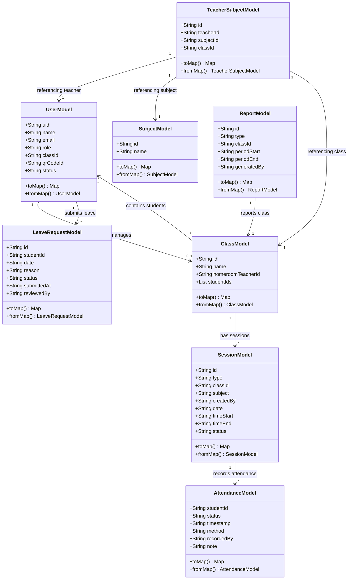

Gambar 6. Class Diagram Sistem Presensi

Desain kelas di atas merinci delapan entitas data utama yang dikelola di basis data aplikasi presensi. Kelas `UserModel` merepresentasikan profil pengguna dengan atribut peran (role) yang membedakan akses antarmuka. Hubungan asosiasi terjalin antara `ClassModel` dan `UserModel` di mana satu kelas menampung banyak siswa, dan satu kelas dikepalai oleh satu guru (Wali Kelas). Kelas `SessionModel` bertindak sebagai penampung aktivitas presensi harian atau mata pelajaran, mencatat koleksi objek `AttendanceModel` di bawahnya. Kelas `LeaveRequestModel` merekam pengajuan ketidakhadiran siswa yang dihubungkan ke ID siswa bersangkutan. Kelas `TeacherSubjectModel`, `SubjectModel`, dan `ReportModel` menyediakan struktur pendukung untuk penugasan pengajaran mata pelajaran dan pelaporan rekapitulasi kehadiran tahunan secara modular.

##### 2. Tabel Database
Dokumentasi tabel database merinci struktur relasi fisik dalam format MySQL (yang digunakan sebagai data pembanding/dokumentasi pada Bab IV skripsi) untuk memperjelas metadata, tipe data, kunci utama, dan indeks relasi.

Sistem presensi ini menggunakan 8 tabel database utama yang saling terhubung:
1. `classes`: Menyimpan data kelas.
2. `users`: Menyimpan data akun pengguna.
3. `subjects`: Menyimpan data mata pelajaran.
4. `teacher_subjects`: Tabel relasi guru, kelas, dan mata pelajaran.
5. `sessions`: Menyimpan data sesi presensi.
6. `attendances`: Menyimpan catatan absensi siswa.
7. `leave_requests`: Menyimpan data surat izin/sakit digital.
8. `reports`: Menyimpan log laporan bulanan/semesteran.

---

###### a) Struktur Tabel Kelas (`classes`)
Tabel `classes` digunakan untuk menyimpan data identitas kelas dan ID guru yang bertugas sebagai Wali Kelas.
*   Nama Tabel: `classes`
*   Primary Key: `id` (VARCHAR)
*   Jumlah Field: 4

| Field | Type | Null | Default | Extra |
|---|---|---|---|---|
| id | VARCHAR(50) | NO | NULL | PRIMARY KEY |
| name | VARCHAR(50) | NO | NULL | - |
| homeroomteacherid | VARCHAR(50) | YES | NULL | FOREIGN KEY |
| createdat | TIMESTAMP | YES | CURRENTTIMESTAMP | - |

Tabel 10. Struktur Tabel Kelas (classes)

---

###### b) Struktur Tabel Pengguna (`users`)
Tabel `users` menyimpan seluruh data kredensial, peran keamanan (role), relasi kelas (untuk siswa), dan ID kode QR siswa.
*   Nama Tabel: `users`
*   Primary Key: `id` (VARCHAR)
*   Jumlah Field: 9

| Field | Type | Null | Default | Extra |
|---|---|---|---|---|
| id | VARCHAR(50) | NO | NULL | PRIMARY KEY |
| name | VARCHAR(100) | NO | NULL | - |
| email | VARCHAR(100) | NO | NULL | UNIQUE |
| password_hash | VARCHAR(255) | NO | NULL | - |
| role | ENUM('admin','gurupiket','gurumapel','siswa') | NO | NULL | - |
| class_id | VARCHAR(50) | YES | NULL | FOREIGN KEY |
| qrcodeid | VARCHAR(100) | YES | NULL | UNIQUE |
| status | ENUM('active','inactive') | YES | 'active' | - |
| createdat | TIMESTAMP | YES | CURRENTTIMESTAMP | - |

Tabel 11. Struktur Tabel Pengguna (users)

Tabel 10. Struktur Tabel Kelas (classes)

---

###### c) Struktur Tabel Mata Pelajaran (`subjects`)
Tabel `subjects` menyimpan data daftar mata pelajaran yang diajarkan di sekolah.
*   Nama Tabel: `subjects`
*   Primary Key: `id` (VARCHAR)
*   Jumlah Field: 3

| Field | Type | Null | Default | Extra |
|---|---|---|---|---|
| id | VARCHAR(50) | NO | NULL | PRIMARY KEY |
| name | VARCHAR(100) | NO | NULL | - |
| createdat | TIMESTAMP | YES | CURRENTTIMESTAMP | - |

Tabel 12. Struktur Tabel Mata Pelajaran (subjects)

Tabel 10. Struktur Tabel Kelas (classes)

---

###### d) Struktur Tabel Guru Mengajar (`teacher_subjects`)
Tabel `teacher_subjects` menyimpan relasi penugasan guru mata pelajaran untuk kelas-kelas tertentu.
*   Nama Tabel: `teacher_subjects`
*   Primary Key: `id` (INT AUTO_INCREMENT)
*   Jumlah Field: 4

| Field | Type | Null | Default | Extra |
|---|---|---|---|---|
| id | INT | NO | NULL | PRIMARY KEY, AUTO_INCREMENT |
| teacher_id | VARCHAR(50) | NO | NULL | FOREIGN KEY |
| subject_id | VARCHAR(50) | NO | NULL | FOREIGN KEY |
| class_id | VARCHAR(50) | NO | NULL | FOREIGN KEY |

Tabel 13. Struktur Tabel Guru Mengajar (teacher_subjects)

---

###### e) Struktur Tabel Sesi Presensi (`sessions`)
Tabel `sessions` merekam pembuatan sesi absen harian oleh guru piket atau sesi mata pelajaran oleh guru mapel.
*   Nama Tabel: `sessions`
*   Primary Key: `id` (VARCHAR)
*   Jumlah Field: 9

| Field | Type | Null | Default | Extra |
|---|---|---|---|---|
| id | VARCHAR(50) | NO | NULL | PRIMARY KEY |
| type | ENUM('harian','mapel') | NO | NULL | - |
| class_id | VARCHAR(50) | NO | NULL | FOREIGN KEY |
| subject_id | VARCHAR(50) | YES | NULL | FOREIGN KEY |
| created_by | VARCHAR(50) | NO | NULL | FOREIGN KEY |
| date | DATE | NO | NULL | - |
| time_start | TIME | NO | NULL | - |
| time_end | TIME | YES | NULL | - |
| status | ENUM('active','closed') | YES | 'active' | - |

Tabel 14. Struktur Tabel Sesi Presensi (sessions)

---

###### f) Struktur Tabel Kehadiran (`attendances`)
Tabel `attendances` mencatat setiap log kehadiran siswa per sesi presensi dengan metode input yang dilakukan.
*   Nama Tabel: `attendances`
*   Primary Key: `id` (INT AUTO_INCREMENT)
*   Jumlah Field: 8

| Field | Type | Null | Default | Extra |
|---|---|---|---|---|
| id | INT | NO | NULL | PRIMARY KEY, AUTO_INCREMENT |
| session_id | VARCHAR(50) | NO | NULL | FOREIGN KEY |
| student_id | VARCHAR(50) | NO | NULL | FOREIGN KEY |
| status | ENUM('hadir','izin','sakit','alpa') | NO | NULL | - |
| timestamp | TIMESTAMP | YES | CURRENT_TIMESTAMP | - |
| method | ENUM('qrscan','manualoverride') | NO | NULL | - |
| recorded_by | VARCHAR(50) | NO | NULL | FOREIGN KEY |
| note | VARCHAR(255) | YES | NULL | - |

Tabel 15. Struktur Tabel Kehadiran (attendances)

---

###### g) Struktur Tabel Surat Izin Siswa (`leave_requests`)
Tabel `leave_requests` mencatat pengajuan surat izin/sakit digital yang dimasukkan oleh siswa secara mandiri.
*   Nama Tabel: `leave_requests`
*   Primary Key: `id` (INT AUTO_INCREMENT)
*   Jumlah Field: 7

| Field | Type | Null | Default | Extra |
|---|---|---|---|---|
| id | INT | NO | NULL | PRIMARY KEY, AUTO_INCREMENT |
| student_id | VARCHAR(50) | NO | NULL | FOREIGN KEY |
| date | DATE | NO | NULL | - |
| reason | TEXT | NO | NULL | - |
| status | ENUM('izin','sakit') | NO | NULL | - |
| submittedat | TIMESTAMP | YES | CURRENTTIMESTAMP | - |
| reviewed_by | VARCHAR(50) | YES | NULL | FOREIGN KEY |

Tabel 16. Struktur Tabel Surat Izin Siswa (leave_requests)

---

###### h) Struktur Tabel Rekap Laporan (`reports`)
Tabel `reports` mencatat histori pembuatan dan pengunduhan laporan kehadiran per periode cetak.
*   Nama Tabel: `reports`
*   Primary Key: `id` (VARCHAR)
*   Jumlah Field: 7

| Field | Type | Null | Default | Extra |
|---|---|---|---|---|
| id | VARCHAR(50) | NO | NULL | PRIMARY KEY |
| type | ENUM('harian','mingguan','bulanan','semesteran') | NO | NULL | - |
| class_id | VARCHAR(50) | NO | NULL | FOREIGN KEY |
| period_start | DATE | NO | NULL | - |
| period_end | DATE | NO | NULL | - |
| generated_by | VARCHAR(50) | NO | NULL | FOREIGN KEY |
| generatedat | TIMESTAMP | YES | CURRENTTIMESTAMP | - |

Tabel 17. Struktur Tabel Rekap Laporan (reports)

---

##### 3. Relasi Tabel
Relasi tabel mendefinisikan hubungan struktural antar entitas data pada basis data relasional. Hubungan ini dirancang menggunakan relasi kardinalitas One-to-Many (1:N) dan Many-to-Many (M:N) guna menjamin integritas referensial data di dalam database. Pada rancangan relasi database aplikasi ini, tabel `users` bertindak sebagai poros utama karena menyimpan seluruh entitas aktor sistem. Tabel `classes` memiliki hubungan One-to-Many ke tabel `users` untuk memetakan penempatan siswa di kelas mereka, serta hubungan One-to-One (diimplementasikan via foreign key opsional) ke guru yang ditugaskan sebagai wali kelas.

Adapun tabel transaksi presensi dibangun dengan relasi dinamis. Tabel `sessions` menampung referensi asing (foreign key) dari tabel `classes` dan `users` (sebagai pembuat sesi). Setiap sesi presensi kemudian terhubung secara One-to-Many ke tabel `attendances`, yang menampung catatan kehadiran setiap siswa. Tabel `leave_requests` berelasi langsung dengan tabel `users` (siswa) untuk melacak pengajuan izin, dan data izin ini disinkronisasikan ke tabel `attendances` melalui pencocokan kolom tanggal untuk memastikan kehadiran otomatis siswa yang izin berjalan konsisten tanpa manipulasi manual dari pengguna luar.

Berikut adalah daftar relasi kunci antar tabel:
*   Tabel `classes` berelasi dengan tabel `users` (homeroomteacherid -> id).
*   Tabel `users` berelasi dengan tabel `classes` (class_id -> id).
*   Tabel `sessions` berelasi dengan `classes` (classid -> id) dan `users` (createdby -> id).
*   Tabel `attendances` berelasi dengan `sessions` (sessionid -> id), `users` (studentid -> id), dan `users` (recorded_by -> id).
*   Tabel `leaverequests` berelasi dengan `users` (studentid -> id).
*   Tabel `teachersubjects` menghubungkan `users` (teacherid -> id), `subjects` (subjectid -> id), dan `classes` (classid -> id).
*   Tabel `reports` mencatat berkas cetak yang berelasi dengan `classes` (classid -> id) dan `users` (generatedby -> id).

Desain hubungan antar tabel tersebut digambarkan menggunakan skema relational designer phpMyAdmin sebagai berikut:

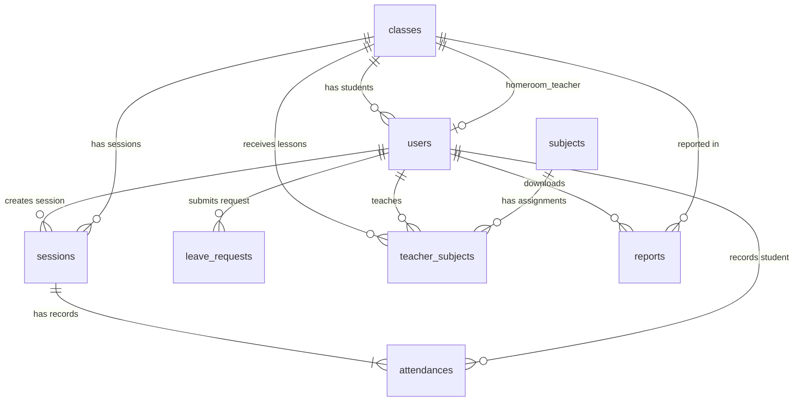

Gambar 7. Relasi Tabel Basis Data (ERD)

---

### 3) desain rancang antarmuka
Tahap perancangan antarmuka (interface design) merumuskan tata letak halaman aplikasi presensi mobile secara visual (low-fidelity mockup) dan menetapkan fungsionalitas dari setiap widget/form inputan.

#### a. Desain Rancang Antarmuka Halaman Login (Shared Screen)
Rancangan antarmuka ini menampilkan kolom input kredensial masuk yang dapat diakses oleh seluruh peran pengguna.

```
+------------------------------------------+
|     SMP MUHAMMADIYAH 1 SECAMPUNG UDIK    |
|                                          |
|                 [ LOGO ]                 |
|                                          |
|  Email:                                  |
|  [ admin@smpm1.sch.id                  ] |
|  Password:                               |
|  [                           ] |
|                                          |
|             (( MASUK SYSTEM ))           |
+------------------------------------------+
```

Gambar 8. Rancang Antarmuka Halaman Login (Shared Screen)

| Widget / Form | Fungsi |
|---|---|
| Text Field Email | Memasukkan alamat email akun terdaftar. |
| Text Field Password | Memasukkan kata sandi keamanan akun. |
| Button Masuk System | Memicu proses autentikasi Firebase Auth dan navigasi dashboard. |

Tabel 18. Fungsionalitas Halaman Login

---

#### b. Desain Rancang Antarmuka Halaman Dashboard Admin
Dasbor ini memberikan akses cepat kepada admin untuk memantau data operasional sekolah dan tombol navigasi CRUD.

```
+------------------------------------------+
| ADMIN DASHBOARD         SMP MUHAMMADIYAH |
+------------------------------------------+
|  [ Total Siswa: 304 ]  [ Total Kelas: 8] |
|  [ Total Sesi:  12  ]                    |
|                                          |
|  Menu Utama:                             |
|  [ (1) Kelola Pengguna ]                 |
|  [ (2) Kelola Kelas    ]                 |
|  [ (3) Cetak QR Siswa  ]                 |
|  [ (4) Laporan & Reset ]                 |
+------------------------------------------+
```

Gambar 9. Rancang Antarmuka Halaman Dashboard Admin

| Widget / Form | Fungsi |
|---|---|
| Card Statistik | Menampilkan total siswa, kelas, dan sesi aktif dari database. |
| Button Menu | Tombol navigasi cepat untuk beralih ke halaman manajemen fungsional. |

Tabel 19. Fungsionalitas Halaman Dashboard Admin

---

#### c. Halaman Kelola Pengguna (Admin)
Halaman ini menampilkan antarmuka pengelolaan tabel pengguna beserta pengunggahan file Excel.

```
+------------------------------------------+
| < KEMBALI                KELOLA PENGGUNA |
+------------------------------------------+
|  Cari Nama: [ Ahmad Dani               ] |
|  Pilih Kelas: [ Semua                  v]|
|                                          |
|  +------------------------------------+  |
|  | Ahmad Dani - Siswa - IX-A          |  |
|  | Budi Santoso - Siswa - IX-B        |  |
|  +------------------------------------+  |
|                                          |
|      (( + BARU ))     (( IMPORT EXCEL )) |
+------------------------------------------+
```

Gambar 10. Rancang Antarmuka Halaman Kelola Pengguna

Gambar 10. Rancang Antarmuka Halaman Kelola Pengguna

| Widget / Form | Fungsi |
|---|---|
| Text Field Cari Nama | Menyaring daftar pengguna berdasarkan kecocokan nama. |
| Button Import Excel | Membuka FilePicker untuk mengunggah file `.xlsx` secara massal. |
| Button + Baru | Membuka modal input form pengguna tunggal. |

Tabel 20. Fungsionalitas Halaman Kelola Pengguna

---

#### d. Halaman Kelola Kelas (Admin)
Halaman ini dirancang untuk mencatat data kelas baru beserta pembagian wali kelasnya.

```
+------------------------------------------+
| < KEMBALI                   KELOLA KELAS |
+------------------------------------------+
|  Nama Kelas:                             |
|  [ Kelas IX-A                          ] |
|  Pilih Wali Kelas:                       |
|  [ Guru Piket 1 (Budi)                v] |
|                                          |
|             (( SIMPAN KELAS ))           |
+------------------------------------------+
```

Gambar 11. Rancang Antarmuka Halaman Kelola Kelas

| Widget / Form | Fungsi |
|---|---|
| Text Field Nama Kelas | Memasukkan nama kelas baru yang ingin didaftarkan. |
| Dropdown Wali Kelas | Memilih guru yang bertugas mengampu kelas tersebut. |
| Button Simpan Kelas | Menulis dokumen kelas baru ke database Cloud Firestore. |

Tabel 21. Fungsionalitas Halaman Kelola Kelas

---

#### e. Halaman Ekspor Laporan & Reset (Admin)
Antarmuka cetak laporan dan penanganan tahun ajaran baru bagi administrator.

```
+------------------------------------------+
| < KEMBALI                LAPORAN & RESET |
+------------------------------------------+
|  Pilih Kelas: [ Kelas IX-A            v] |
|  Rincian Sesi Kehadiran:                 |
|  - Jumlah Siswa: 32 siswa                |
|  - Total Sesi: 24 sesi                   |
|                                          |
|         (( UNDUH LAPORAN (EXCEL) ))      |
|                                          |
|   (( RESET DATA TAHUN AJARAN BARU ))     |
+------------------------------------------+
```

Gambar 12. Rancang Antarmuka Halaman Ekspor Laporan & Reset

| Widget / Form | Fungsi |
|---|---|
| Dropdown Pilih Kelas | Memilih kelas target ekspor laporan. |
| Button Unduh Laporan | Membuat dan mengunduh berkas `.xlsx` ter-styling secara lokal. |
| Button Reset Data | Memicu popup peringatan untuk menghapus seluruh data presensi. |

Tabel 22. Fungsionalitas Halaman Ekspor Laporan & Reset

---

#### f. Halaman Dashboard Guru Piket
Tampilan dasbor pemantauan sesi harian dan izin siswa bagi guru piket.

```
+------------------------------------------+
| PIKET DASHBOARD         SMP MUHAMMADIYAH |
+------------------------------------------+
|  [ Sesi Aktif: 2 ]   [ Hari: Kamis     ] |
|                                          |
|  Daftar Kelas Aktif:                     |
|  - Kelas IX-A (Harian - Berjalan)        |
|  - Kelas IX-B (Harian - Berjalan)        |
|                                          |
|      (( BUKA SESI HARIAN ))              |
|                                          |
|  *Riwayat Izin Siswa Kelas Asuhan (Wali)*|
|  - 09/07: Dani (IX-A) - Sakit: Demam     |
+------------------------------------------+
```

Gambar 13. Rancang Antarmuka Halaman Dashboard Guru Piket

| Widget / Form | Fungsi |
|---|---|
| Button Buka Sesi Harian | Navigasi ke formulir pembukaan sesi presensi harian. |
| List Riwayat Izin Wali | Menampilkan surat izin khusus siswa binaannya (jika Wali Kelas). |

Tabel 23. Fungsionalitas Halaman Dashboard Guru Piket

---

#### g. Halaman Buka Sesi Harian (Guru Piket)
Formulir pembukaan sesi absen harian.

```
+------------------------------------------+
| < KEMBALI               BUKA SESI HARIAN |
+------------------------------------------+
|  Pilih Kelas Sasaran:                    |
|  [ Kelas IX-A                         v] |
|  Tanggal Presensi:                       |
|  [ 09/07/2026                         v] |
|                                          |
|             (( AKTIFKAN SESI ))          |
+------------------------------------------+
```

Gambar 14. Rancang Antarmuka Halaman Buka Sesi Harian

| Widget / Form | Fungsi |
|---|---|
| Dropdown Pilih Kelas | Menentukan kelas yang akan dibuka sesinya. |
| Button Aktifkan Sesi | Membuat dokumen sesi harian aktif di database Firestore. |

Tabel 24. Fungsionalitas Halaman Buka Sesi Harian

---

#### h. Halaman Input Kehadiran Massal (Guru Mapel)
Halaman input kehadiran massal setelah guru mapel melakukan scan QR meja kelas.

```
+------------------------------------------+
| < KEMBALI          PRESENSI MASSAL KELAS |
+------------------------------------------+
|  Mata Pelajaran: [ Kimia               ] |
|  Kelas: IX-A                             |
|  Total: 3 Siswa                          |
|                                          |
|  Daftar Siswa:                           |
|  1. Ahmad Dani                           |
|     [ Hadir (Hijau) ] [ Tidak Hadir ]    |
|                                          |
|  2. Budi Santoso (Izin: Acara Keluarga)  |
|     [ Hadir ] [ Tidak Hadir (Merah) ]    |
|     Status: (x) Izin  ( ) Sakit  ( ) Alpa|
|                                          |
|            (( KIRIM PRESENSI ))          |
+------------------------------------------+
```

Gambar 15. Rancang Antarmuka Halaman Input Kehadiran Massal

| Widget / Form | Fungsi |
|---|---|
| Text Field Mata Pelajaran | Memasukkan nama mata pelajaran aktif yang sedang diajarkan. |
| Toggle Kehadiran Siswa | Menentukan status kehadiran dasar siswa dengan cepat. |
| Radio Group Status Absen | Memilih detail status ketidakhadiran (Izin, Sakit, Alpa) saat ditandai "Tidak Hadir". |
| Button Kirim Presensi | Menyimpan seluruh data sesi mapel (closed) dan kehadiran massal ke Firestore. |

Tabel 25. Fungsionalitas Halaman Input Kehadiran Massal

---

#### i. Halaman Dashboard Siswa
Halaman utama siswa menampilkan ringkasan persentase kehadiran personal siswa.

```
+------------------------------------------+
| SISWA DASHBOARD         SMP MUHAMMADIYAH |
+------------------------------------------+
|  Selamat Datang, Siswa 1                 |
|  Hadir: 92% | Sakit: 2% | Izin: 4% | Alpa: 2%|
|                                          |
|  Sesi Presensi Aktif Hari Ini:           |
|  - Sesi Harian IX-A [ SCAN QR SEKARANG ] |
|                                          |
|  Menu Siswa:                             |
|  [ (1) Riwayat Absen ]  [ (2) Ajukan Izin] |
+------------------------------------------+
```

Gambar 16. Rancang Antarmuka Halaman Dashboard Siswa

| Widget / Form | Fungsi |
|---|---|
| Button Scan QR | Membuka modul kamera pemindai gawai guru. |
| Button Ajukan Izin | Navigasi ke halaman pengisian surat izin sakit/izin. |

Tabel 26. Fungsionalitas Halaman Dashboard Siswa

---

#### j. Halaman Pengajuan Izin (Siswa)
Formulir pengisian ketidakhadiran siswa dengan daftar riwayat pengajuan di bagian bawah.

```
+------------------------------------------+
| < KEMBALI          PENGAJUAN IZIN DIGITAL|
+------------------------------------------+
|  Tanggal Izin: [ 09/07/2026 ]  [ ICON ]  |
|                                          |
|  Pilih Status Kehadiran:                 |
|  [ Sakit / Izin (Dropdown)            v ]|
|                                          |
|  Alasan Tidak Hadir:                     |
|  [ Tulis alasan detail disini...        ]|
|  [                                      ]|
|                                          |
|            (( KIRIM PENGAJUAN ))         |
|                                          |
|  Riwayat Pengajuan:                      |
|  +------------------------------------+  |
|  | 09/07/2026 - Sakit: Demam Tinggi   |  |
|  +------------------------------------+  |
+------------------------------------------+
```

Gambar 17. Rancang Antarmuka Halaman Pengajuan Izin

| Widget / Form | Fungsi |
|---|---|
| Dropdown Status | Memilih kategori sakit atau izin tepat di atas kolom alasan. |
| Text Field Alasan | Mengisi deskripsi tertulis ketidakhadiran. |
| List Riwayat Izin | Menampilkan surat izin siswa terdahulu dengan opsi ubah/hapus. |

Tabel 27. Fungsionalitas Halaman Pengajuan Izin

---

### 4) construction
Fase konstruksi (construction) dalam metodologi RAD merupakan tahap pengodean secara intensif untuk mewujudkan desain arsitektur dan antarmuka pengguna ke dalam baris kode fungsional aplikasi sesungguhnya. Pada fase ini, seluruh logika pemrograman diimplementasikan menggunakan bahasa Dart dan framework Flutter dengan memanfaatkan model data terstruktur serta state management Provider untuk memastikan performa yang cepat dan reaktif. Penyusunan baris kode dilakukan secara bertahap, mulai dari pembuatan model data, penulisan service database Cloud Firestore, hingga perancangan widget antarmuka pengguna secara modular.

Selama fase konstruksi ini, pengembang secara aktif berinteraksi dengan basis data Firebase untuk menguji kelancaran sinkronisasi data presensi secara real-time. Setiap perubahan kode diuji secara berulang menggunakan fitur Hot Reload pada Flutter untuk mengamati respon antarmuka dan memvalidasi kebenaran alur kerja sistem. Dengan menerapkan konsep pengodean yang bersih (clean code) dan penanganan kesalahan (error handling) yang kuat, fase konstruksi ini berhasil menghasilkan aplikasi presensi yang stabil dan siap diuji coba secara fungsional.

#### a. Proses Pengkodingan Sistem (IDE VSCode)
Proses penulisan kode program (development) dilaksanakan menggunakan perangkat lunak editor teks Visual Studio Code (VS Code) yang terintegrasi dengan SDK Flutter versi terbaru. Editor VS Code dipilih karena memiliki ekosistem ekstensi yang sangat kaya, seperti ekstensi Dart dan Flutter, yang mempercepat analisis kode statis dan mempermudah pencarian pustaka program. Konfigurasi IDE disesuaikan dengan menyematkan modul penata tata letak kode otomatis (auto-formatter) setiap kali berkas disimpan, menjaga struktur baris program tetap rapi dan konsisten sesuai standar Clean Code.

Guna menjaga performa aplikasi agar tetap responsif saat melakukan transaksi data besar ke Firebase, seluruh panggilan database dirancang menggunakan paradigma Asynchronous Programming (`async`/`await`). Pemrograman asinkron ini menjamin bahwa antarmuka pengguna (UI thread) tidak akan mengalami pembekuan (freeze) atau patah-patah ketika aplikasi sedang menunggu respon data dari Cloud Firestore. Struktur data dikemas dalam bentuk data transfer object (DTO) sebelum dikirimkan melintasi jaringan internet.

Selain itu, manajemen perubahan berkas kode (versioning) dikelola secara disiplin menggunakan sistem kontrol Git (Git Version Control). Setiap perubahan fitur, perbaikan bug, maupun modifikasi struktur kelas dicatat melalui pesan komit (commit message) yang informatif dan didorong (pushed) ke repositori GitHub. Hal ini memastikan kelancaran pelacakan histori modifikasi program dan mempermudah proses integrasi kode antar komponen aplikasi.

#### b. Perancangan Model / Database Design
Perancangan model data di dalam kode program Flutter diwujudkan melalui pembentukan kelas-kelas model (Data Model Classes) yang mewakili skema penyimpanan dokumen Firestore. Setiap kelas model dilengkapi dengan metode serialisasi `toMap()` untuk mengubah objek Dart menjadi data bertipe Map sebelum disimpan ke dokumen Firestore, serta metode deserialisasi `fromMap()` untuk membaca kembali data Map dari Firestore menjadi objek Dart yang siap dirender di layar.

Berikut adalah implementasi kode program untuk perancangan kelas model data pengguna (`UserModel`), sesi presensi (`SessionModel`), surat izin siswa (`LeaveRequestModel`), dan kehadiran (`AttendanceModel`):

```dart
// lib/models/user_model.dart
class UserModel {
  final String uid;
  final String name;
  final String email;
  final String role;
  final String? classId;
  final String? qrCodeId;
  final String status;

  UserModel({
    required this.uid,
    required this.name,
    required this.email,
    required this.role,
    this.classId,
    this.qrCodeId,
    required this.status,
  });

  Map<String, dynamic> toMap() {
    return {
      'uid': uid,
      'name': name,
      'email': email,
      'role': role,
      'class_id': classId,
      'qrcodeid': qrCodeId,
      'status': status,
    };
  }

  factory UserModel.fromMap(String uid, Map<dynamic, dynamic> map) {
    return UserModel(
      uid: uid,
      name: map['name'] ?? '',
      email: map['email'] ?? '',
      role: map['role'] ?? 'siswa',
      classId: map['class_id'],
      qrCodeId: map['qrcodeid'],
      status: map['status'] ?? 'active',
    );
  }
}

// lib/models/session_model.dart
class SessionModel {
  final String id;
  final String type;
  final String classId;
  final String? subject;
  final String createdBy;
  final String date;
  final String timeStart;
  final String? timeEnd;
  final String status;

  SessionModel({
    required this.id,
    required this.type,
    required this.classId,
    this.subject,
    required this.createdBy,
    required this.date,
    required this.timeStart,
    this.timeEnd,
    required this.status,
  });

  Map<String, dynamic> toMap() {
    return {
      'id': id,
      'type': type,
      'class_id': classId,
      'subject': subject,
      'created_by': createdBy,
      'date': date,
      'time_start': timeStart,
      'time_end': timeEnd,
      'status': status,
    };
  }

  factory SessionModel.fromMap(String id, Map<dynamic, dynamic> map) {
    return SessionModel(
      id: id,
      type: map['type'] ?? 'harian',
      classId: map['class_id'] ?? '',
      subject: map['subject'],
      createdBy: map['created_by'] ?? '',
      date: map['date'] ?? '',
      timeStart: map['time_start'] ?? '',
      timeEnd: map['time_end'],
      status: map['status'] ?? 'active',
    );
  }
}

// lib/models/attendance_model.dart
class AttendanceModel {
  final String studentId;
  final String status;
  final String timestamp;
  final String method;
  final String recordedBy;
  final String? note;

  AttendanceModel({
    required this.studentId,
    required this.status,
    required this.timestamp,
    required this.method,
    required this.recordedBy,
    this.note,
  });

  Map<String, dynamic> toMap() {
    return {
      'student_id': studentId,
      'status': status,
      'timestamp': timestamp,
      'method': method,
      'recorded_by': recordedBy,
      'note': note,
    };
  }

  factory AttendanceModel.fromMap(Map<dynamic, dynamic> map) {
    return AttendanceModel(
      studentId: map['student_id'] ?? '',
      status: map['status'] ?? 'alpa',
      timestamp: map['timestamp'] ?? '',
      method: map['method'] ?? 'manual_override',
      recordedBy: map['recorded_by'] ?? '',
      note: map['note'],
    );
  }
}
```

#### c. Implementasi Interface
Implementasi antarmuka mewujudkan rancangan tata letak halaman ke dalam widget visual Flutter yang interaktif dan responsif untuk berbagai ukuran layar smartphone Android.

##### 1. Implementasi Antarmuka Peran Admin
Antarmuka pengguna untuk admin dirancang dengan memprioritaskan efisiensi akses data master sekolah dan modul unduhan laporan presensi.

###### a) Dashboard Admin
Menyajikan panel ringkasan visual real-time mengenai data seluruh sekolah berupa jumlah siswa, kelas, dan sesi presensi harian/mapel yang aktif.

###### b) Kelola Pengguna
Menyediakan halaman daftar tabel dinamis. Admin dapat menambahkan akun pengguna baru atau memicu impor bulk via berkas Excel (.xlsx).

###### c) Kelola Kelas
Form input untuk mendaftarkan nama kelas baru dan menugaskan guru tertentu sebagai Wali Kelas yang berwenang memantau surat izin kelas asuhannya.

###### d) Ekspor Laporan & Reset
Tampilan menu unduh laporan Excel (.xlsx) per kelas dengan styling lengkap serta tombol reset data kehadiran secara massal.

---

##### 2. Implementasi Antarmuka Peran Guru Piket & Mapel
Antarmuka guru difokuskan pada kecepatan interaksi pemindaian QR Code dan input kehadiran massal secara instan di dalam kelas.

###### a) Dashboard Guru Piket & Monitoring
Menampilkan ringkasan daftar sesi presensi aktif dan log pengajuan surat izin sakit/izin siswa kelas asuhannya (jika bertindak sebagai Wali Kelas).

###### b) Buka Sesi Presensi Harian
Tampilan form untuk mengaktifkan sesi absen kelas pada tanggal berjalan agar siswa dapat memindai QR code mereka ke gawai guru piket.

###### c) Halaman Scan QR Meja Kelas
Tampilan detektor kamera menggunakan library `mobile_scanner` untuk mengidentifikasi ID Kelas secara otomatis saat guru memindai QR code meja.

###### d) Halaman Input Kehadiran Massal
Tampilan daftar siswa kelas dengan toggle `Hadir` / `Tidak Hadir` yang ringkas. Siswa yang berizin/sakit secara otomatis ter-prepopulasi ke statusnya masing-masing.

---

##### 3. Implementasi Antarmuka Peran Siswa
Antarmuka dirancang dengan mengutamakan kesederhanaan navigasi presensi mandiri dan kemudahan pengajuan surat izin sakit/izin digital.

###### a) Dashboard Siswa
Halaman utama yang menampilkan grafik persentase kehadiran personal siswa, tombol cetak kode QR siswa, dan sesi presensi aktif.

###### b) Tampilan Halaman Pengajuan Izin
Formulir input status izin (Sakit/Izin) dan bidang teks pengisian alasan ketidakhadiran, disusul tabel riwayat pengajuan izin di bagian bawah yang dapat diubah atau dihapus siswa.

###### c) Riwayat Kehadiran Pribadi
Tampilan histori rekap kehadiran harian dan pelajaran siswa yang dilengkapi filter berdasarkan status kehadiran.

---

### Kelemahan Sistem
Meskipun sistem presensi berbasis mobile ini telah berhasil mengotomasi alur kerja kehadiran di SMP Muhammadiyah 1 Sekampung Udik secara real-time, sistem ini masih memiliki beberapa kelemahan fungsional yang perlu diperbaiki pada pengembangan selanjutnya. Kelemahan utamanya terletak pada ketergantungan penuh aplikasi terhadap jaringan koneksi internet yang stabil untuk berkomunikasi dengan basis data Cloud Firestore. Jika gawai guru mata pelajaran atau guru piket berada di area sekolah yang memiliki jangkauan sinyal buruk, proses sinkronisasi kehadiran massal dan validasi kode QR siswa akan mengalami penundaan (delay) atau bahkan kegagalan transaksi data akibat terpicunya batas waktu koneksi (timeout 10 detik). Selain itu, sistem keamanan kartu kode QR siswa saat ini belum dilengkapi dengan fitur geolokasi (GPS tracking) atau batasan alamat IP, sehingga masih membuka celah terjadinya manipulasi di mana seorang siswa dapat mengirimkan foto tangkapan layar kode QR miliknya kepada teman sekelasnya untuk dipindai, yang memungkinkan terjadinya penitipan presensi kehadiran meskipun siswa yang bersangkutan tidak hadir secara fisik di ruangan kelas. Kelemahan lain adalah belum adanya fitur penyimpanan lokal (local storage caching) untuk presensi luring (offline), sehingga ketika koneksi terputus, presensi tidak dapat direkam sementara di memori perangkat gawai.
